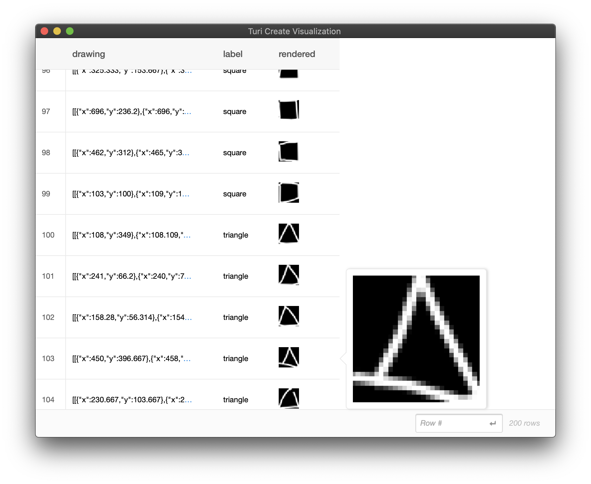

# Quick, Draw! Data Preparation

In this section, we will show you how to download a publicly available dataset
and load it into an SFrame. This will allow you to try out the Drawing Classifier
toolkit for yourself. We will get this dataset into the format expected by our
toolkit.

*Note: Please make sure that you have Turi Create 5.4 or above for these steps*

The dataset that we will use is 
[Quick, Draw!](https://quickdraw.withgoogle.com/data)<sup>1</sup>. Our goal is to
make a drawing classifier for squares and triangles. 

First, we will download all the data points in the "Quick, Draw!" dataset for
the "square" and "triangle" classes -- around 120,000 examples each, 
both as bitmaps and as stroke-based drawings.

Open a new terminal window, go to your working directory and run the following commands:

```
$ mkdir quickdraw
$ cd quickdraw
$ mkdir bitmaps
$ mkdir strokes
$ mkdir sframes
$ cd bitmaps
$ curl https://storage.googleapis.com/quickdraw_dataset/full/numpy_bitmap/square.npy > square.npy # around 93 MB
$ curl https://storage.googleapis.com/quickdraw_dataset/full/numpy_bitmap/triangle.npy > triangle.npy # around 92 MB
$ cd ../strokes
$ curl https://storage.googleapis.com/quickdraw_dataset/full/raw/square.ndjson > square.ndjson # around 242 MB
$ curl https://storage.googleapis.com/quickdraw_dataset/full/raw/triangle.ndjson > triangle.ndjson # around 194 MB
```

Now, you should have the following file structure:

```
quickdraw/
    bitmaps/
        square.npy
        triangle.npy
    strokes/
        square.ndjson
        triangle.ndjson
    sframes/

```

Next, for both bitmap and stroke-based drawing input formats, 
we will sample 100 examples from each of the classes and turn it into an SFrame.
For a small number of classes, we need very few training examples per class. 
In fact, in the [example](README.md) that trains a model on these datasets,
we do a small train/test split (0.4) thereby training on a small number of 
examples but testing on a larger number of examples.

#### Using Bitmap Data

Here is a snippet to sample 100 examples per class into an SFrame for bitmap 
data as the input format:

```python
import turicreate as tc
import numpy as np
import os

random_state = np.random.RandomState(100)

# Change if applicable
quickdraw_dir = 'quickdraw'
bitmaps_dir = os.path.join(quickdraw_dir, 'bitmaps')
sframes_dir = os.path.join(quickdraw_dir, 'sframes')
npy_ext = '.npy'
num_examples_per_class = 100
classes = ["square", "triangle"]
num_classes = len(classes)

def build_bitmap_sframe():
    bitmaps_list, labels_list = [], []
    for class_name in classes:
        class_data = np.load(os.path.join(bitmaps_dir, class_name + npy_ext))
        random_state.shuffle(class_data)
        class_data_selected = class_data[:num_examples_per_class]
        class_data_selected = class_data_selected.reshape(
            class_data_selected.shape[0], 28, 28, 1)
        for np_pixel_data in class_data_selected:
            FORMAT_RAW = 2
            bitmap = tc.Image(_image_data = np_pixel_data.tobytes(),
                              _width = np_pixel_data.shape[1],
                              _height = np_pixel_data.shape[0],
                              _channels = np_pixel_data.shape[2],
                              _format_enum = FORMAT_RAW,
                              _image_data_size = np_pixel_data.size)
            bitmaps_list.append(bitmap)
            labels_list.append(class_name)
    sf = tc.SFrame({"drawing": bitmaps_list, "label": labels_list})
    sf.save(os.path.join(sframes_dir, "bitmap_square_triangle.sframe"))

build_bitmap_sframe()
```

#### Using Stroke-Based Drawing Data

For stroke-based drawing data to be given as the feature in the input SFrame 
to `turicreate.drawing_classifier.create`, the stroke-based drawing data 
must adhere to the following format:

Each drawing must be represented as a list of strokes, where each stroke must 
be represented as a list of points in the order that they were drawn. 
Each point must be represented as a dictionary with exactly two keys, 
"x" and "y", the values of which must be numerical, i.e. integer or float.
Here is an example of a drawing with two strokes that have five points each:

```python
example_drawing = [
    [
        {"x": 1.0, "y": 2.0},
        {"x": 2.0, "y": 2.0},
        {"x": 3.0, "y": 2.0},
        {"x": 4.0, "y": 2.0},
        {"x": 5.0, "y": 2.0}
    ], # end of first stroke
    [
        {"x": 10.0, "y": 10.0},
        {"x": 10.5, "y": 10.5},
        {"x": 11.0, "y": 11.0},
        {"x": 12.5, "y": 12.5},
        {"x": 15.0, "y": 15.0}
    ]
]
```

Our first task at hand is to build an SFrame that adheres to this format from 
the "Quick, Draw!" data that we have downloaded. 
Here is a snippet to accomplish that:
```python
import turicreate as tc
import numpy as np
import os
import json

random_state = np.random.RandomState(100)

# Change if applicable
quickdraw_dir = 'quickdraw'
strokes_dir = os.path.join(quickdraw_dir, 'strokes')
sframes_dir = os.path.join(quickdraw_dir, 'sframes')
ndjson_ext = '.ndjson'
num_examples_per_class = 100
classes = ["square", "triangle"]
num_classes = len(classes)

def build_strokes_sframe():
    drawings_list, labels_list = [], []
    for class_name in classes:
        with open(os.path.join(strokes_dir, class_name+ndjson_ext)) as fin:
            ndjson_data = list(map(lambda x: x.strip(), fin.readlines()))
        random_state.shuffle(ndjson_data)
        ndjson_data_selected = list(map(json.loads, ndjson_data[:num_examples_per_class]))
        raw_drawing_list = [ndjson["drawing"] for ndjson in ndjson_data_selected]
        def raw_to_final(raw_drawing):
            return [
                [
                    {
                        "x": raw_drawing[stroke_id][0][i], 
                        "y": raw_drawing[stroke_id][1][i]
                    } for i in range(len(raw_drawing[stroke_id][0]))
                ] 
                for stroke_id in range(len(raw_drawing))
            ]

        final_drawing_list = list(map(raw_to_final, raw_drawing_list))
        drawings_list.extend(final_drawing_list)
        labels_list.extend([class_name] * num_examples_per_class)
    sf = tc.SFrame({"drawing": drawings_list, "label": labels_list})
    sf.save(os.path.join(sframes_dir, "stroke_square_triangle.sframe"))

build_strokes_sframe()
```

When stroke-based drawing data is given as input to the Drawing Classifier 
Toolkit either at train or inference time, the toolkit converts the 
stroke-based drawings into bitmaps as part of preprocessing so the 
Neural Network can consume them. See [How it works!](how-it-works.md) for
more information about the preprocessing done under the hood.

To visualize what your stroke-based drawings look like when rendered as a 
bitmap, you can run the following utility function:
```python
sf = build_stroke_sframe()
sf["rendered"] = tc.drawing_classifier.util.draw_strokes(sf["drawing"])
sf.explore()
```

This is what the rendered drawings would look like:



After building the two SFrames, your directory structure should look like the
following:
```
quickdraw/
    bitmaps/
        square.npy
        triangle.npy
    strokes/
        square.ndjson
        triangle.ndjson
    sframes/
        bitmap_square_triangle.sframe
        stroke_square_triangle.sframe
```
