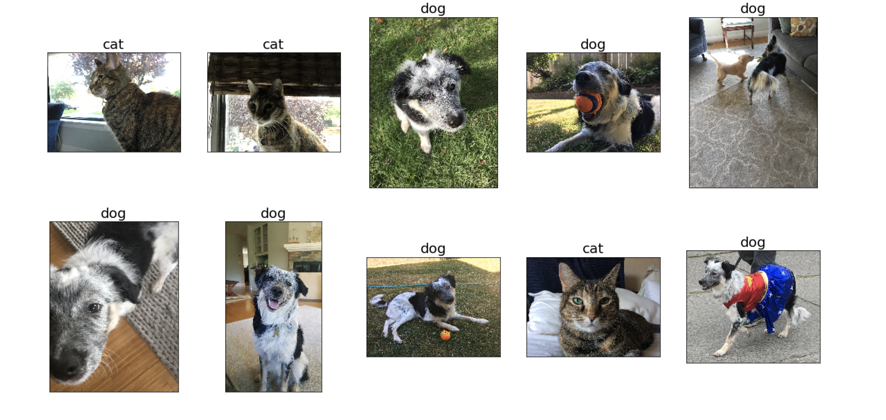

# Image Classification

Given an image, the goal of an image classifier is to assign it to one
of a pre-determined number of labels.  Deep learning methods have
recently been shown to give incredible results on this challenging
problem. Yet this comes at the cost of extreme sensitivity to model
hyper-parameters and long training time. This means that one can spend
months testing different model configurations, much too long to be
worth the effort. However, the image classifier in Turi Create is
designed to minimize these pains, and making it possible to easily
create a high quality image classifier model.

#### Loading Data

The [Kaggle Cats and Dogs Dataset](https://www.microsoft.com/en-us/download/details.aspx?id=54765) provides labeled cat and dog images.[<sup>1</sup>](../datasets.md) After downloading and decompressing the dataset, navigate to the main **kagglecatsanddogs** folder, which contains a **PetImages** subfolder.

```python
import turicreate as tc

# Load images (Note:'Not a JPEG file' errors are simply warnings, meaning those files will simply be skipped)
data = tc.image_analysis.load_images('PetImages', with_path=True)

# From the path-name, create a label column
data['label'] = data['path'].apply(lambda path: 'dog' if '/Dog' in path else 'cat')

# Save the data for future use
data.save('cats-dogs.sframe')

# Explore interactively
data.explore()
```

#### Introductory Example

The task is to **predict if a picture is a cat or a dog**.  Let’s
explore the use of the image classifier on the Cats vs. Dogs dataset.

```python
import turicreate as tc

# Load the data
data =  tc.SFrame('cats-dogs.sframe')

# Make a train-test split
train_data, test_data = data.random_split(0.8)

# Create the model
model = tc.image_classifier.create(train_data, target='label')

# Save predictions to an SArray
predictions = model.predict(test_data)

# Evaluate the model and print the results
metrics = model.evaluate(test_data)
print(metrics['accuracy'])

# Save the model for later use in Turi Create
model.save('mymodel.model')

# Export for use in Core ML
model.export_coreml('MyCustomImageClassifier.mlmodel')
```

Here are some predictions on our own favorite cats and dogs:

```python
new_cats_dogs['predictions'] = model.predict(new_cats_dogs)
```



#### Advanced Usage

Refer to the following chapters for:
* [Advanced](advanced-usage.md) usage options including the use of GPUs and deployment to device.
* [Technical details](how-it-works.md) on how the image classifier works.

In addition, the following chapters contain more information on how to use classifiers:

* [Accessing attributes of the model](../supervised-learning/linear-regression.md#accessing-attributes-of-the-model)
* [Evaluating Results](../supervised-learning/logistic-regression.md#evaluating-results)
* [Multiclass Classification](../supervised-learning/logistic-regression.md#multiclass-classification)
