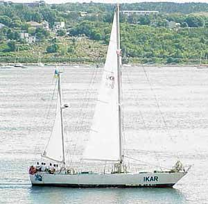
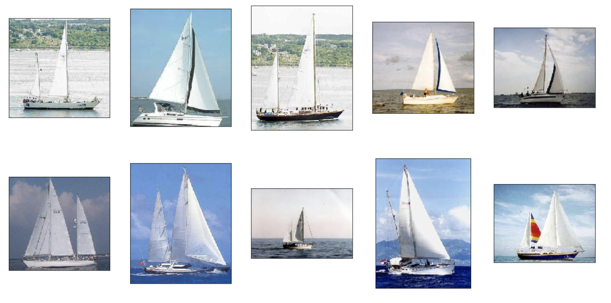

# Image similarity

Given an image, the goal of an image similarity model is to find
"similar" images. Just like in [image
classification](../image_classifier/introduction.md), deep learning
methods have been shown to give incredible results on this challenging
problem. However, unlike in image similarity, there isn't a need to
generate labeled images for model creation. This model is completely
unsupervised.

#### Creating the model

In this example, we use the [Caltech-101
dataset](http://www.vision.caltech.edu/Image_Datasets/Caltech101/)
which contains images objects belonging to 101 categories with about 40
to 800 images per category.

```python
import turicreate as tc

# Load images from the downloaded data
reference_data  = tc.image_analysis.load_images('./101_ObjectCategories')
reference_data = reference_data.add_row_number()

# Save the data for future use
reference_data.save('caltech-101.sframe')
```

We can explore the data interactively using:
```python
reference_data.explore()
```

Next, we create an **image similarity** model using the data (commonly
called **reference data**)
```python
model = tc.image_similarity.create(reference_data)
```

#### Querying the model

Once created, we can query the model to retrieve the five closest images
in the original reference data. The result of the query method is an
SFrame with four columns: query label, reference label, distance, and
rank of the reference point among the query point's nearest neighbors.

```python
similar_images = model.query(reference_data[0:10], k=10)
similar_images.head()
```
```no-highlight
+-------------+-----------------+---------------+------+
| query_label | reference_label |    distance   | rank |
+-------------+-----------------+---------------+------+
|      0      |        0        |      0.0      |  1   |
|      0      |       2557      | 18.3461090355 |  2   |
|      0      |       7000      | 18.3861360371 |  3   |
|      0      |       2664      |  18.655464356 |  4   |
|      0      |       1968      |  18.887705352 |  5   |
|      0      |       7764      | 19.0063301087 |  6   |
|      0      |       4296      | 19.0114573751 |  7   |
|      0      |       221       | 19.1188139256 |  8   |
|      0      |       1361      | 19.1415785143 |  9   |
|      0      |       1148      | 19.1690505999 |  10  |
+-------------+-----------------+---------------+------+
[100 rows x 4 columns]
```

Now, for a simple image like this (let's say the 9th image in the data)
```python
reference_data[9].show()
```


The 10 most "similar" looking images are
```python
similar_images[similar_images['query_label'] == 9].explore()
```



#### Similarity graph

In some cases, we want to find the most similar images in the reference
dataset for all images in the reference dataset. The similarity_graph
method returns an SGraph whose vertices are the rows of the reference
dataset and whose edges indicate a nearest neighbor match. Specifically,
the destination vertex of an edge is a nearest neighbor of the source
vertex. `similarity_graph` can also return results in the same form as the
query method if so desired.

```python
similarity_graph = model.similarity_graph(k=10)
similar_images = similarity_graph.edges
```
```no-highlight
+----------+----------+---------------+------+
| __src_id | __dst_id |    distance   | rank |
+----------+----------+---------------+------+
|   1145   |   3031   | 16.6532360195 |  1   |
|   1145   |   8627   | 16.7883178946 |  2   |
|   1145   |   8559   | 16.9748661517 |  3   |
|   1145   |   238    | 17.6599250835 |  10  |
|   1158   |   4523   | 17.0756179217 |  2   |
|   1161   |   7422   | 16.9777686727 |  2   |
|   1161   |   1203   | 17.1384324655 |  7   |
|   1180   |   6636   | 16.7749244209 |  9   |
|   1182   |   3276   | 16.8179663995 |  5   |
|   1182   |   7717   |  16.889624839 |  6   |
+----------+----------+---------------+------+
[91440 rows x 4 columns]
```

#### How it works

The key ideas in the image similarity model are similar to those in
[image classifier](../image_classifier/how-it-works.md). When you run
the Turi Create image classifier, it breaks things down into something
like this:

* **Stage 1**: Uses a pre-trained CNN classifier on a large, general
  dataset. A good example is ImageNet, with 1000 categories and 1.2
million images.

* **Stage 2**: The outputs of each layer in the CNN can be viewed as a
  meaningful vector representation of each image. Extract these feature
vectors from the layer prior to the output layer on each image of your
task.

* **Stage 3**: Create a [nearest
  neighbours](../nearest_neighbors/nearest_neighbors.md) model with those
features as input for your own task.

#### References

- [1] L. Fei-Fei, R. Fergus and P.  Perona. One-Shot learning of object
categories. IEEE Trans. Pattern Recognition and Machine Intelligence.
