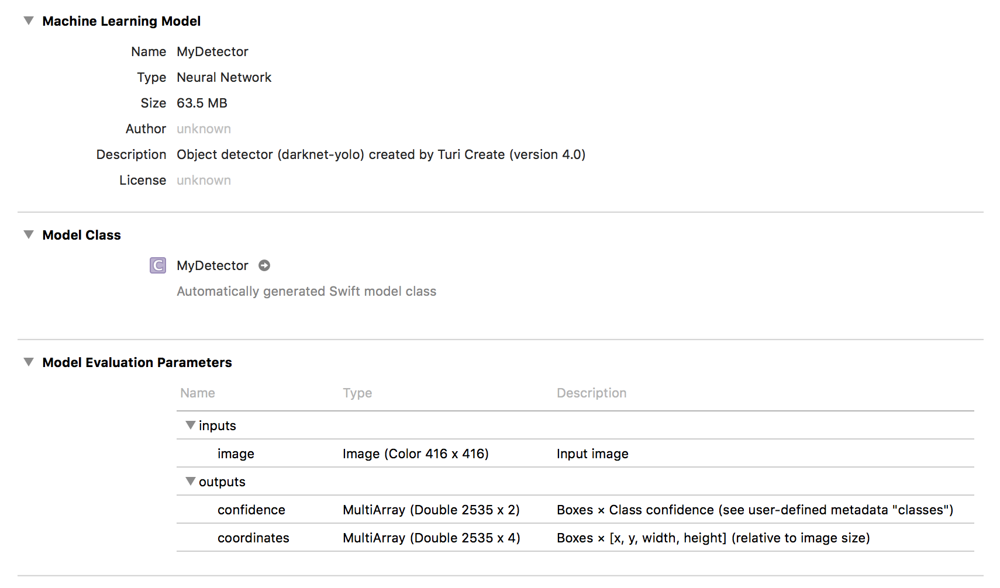
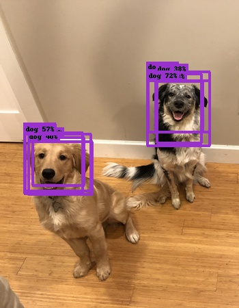

# Advanced Usage

This page describes evaluation metrics in more detail as well as how to deploy
your detector to an iOS or macOS app using Core ML.

#### Evaluation {#evaluation}

If you hold out ground truth data before model creation, you can use it for
quantiative model evaluation. You can do this by splitting your ground truth
data:

```python
import turicreate as tc

train, val = data.random_split(0.8)
model = tc.object_detector.create(train)
scores = model.evaluate(val)
print(scores['mean_average_precision'])
```
```no-highlight
0.23121281
```

Note, if we run the evaluation on `train`, it will get a significantly higher
score and not be representative of how the model will perform on new data.
Let's discuss how to interpret the score 23.1%.  As we describe how this metric
is calculated, you will realize why it is hard to get a high score. As a
result, you might find that a value of 25% mAP represents a more predictive
model than it may sound.

First, we need to define what a correct prediction is.
Your model will unlikely give a bounding box that corresponds to the ground
truth perfectly, so we need a measurement of how close we are. For this,
a score called
[intersection-over-union](https://en.wikipedia.org/wiki/Jaccard_index) (IoU) is
used. It is a value between 0% (no overlap) and 100% (perfect overlap). Here
are a few examples:


For a prediction to be considered correct, it needs to have the correct class
label and an IoU score against the ground truth that is greater than a
pre-determined threshold. As you can see in the examples, if a precise
localization is not critically important, then a threshold of 50% may be suitable. If two
or more predictions have an IoU greater than the threshold, only one gets
designated as *correct* (true positive, TP) and the rest as *incorrect* (false
positive, FP). Ground truth bounding boxes that were completely ignored by the model are also considered *incorrect* (false negative, FN).

Based on these three types of predictions (TP/FP/FN) we can compute [precision
and recall](https://en.wikipedia.org/wiki/Precision_and_recall) scores.
However, before we do this, remember that the model also associates each
prediction with a confidence score between 0% and 100% (remember the prediction
image with two dogs).  We use this by considering a *confidence threshold* and
rejecting predictions if they fall below it prior to computing TP/FP/FN.
Instead of setting this threshold manually, we calculate scores for all
possible thresholds and plot the resulting precision and recall for each
threshold value as a curve. The *average precision* is the area under this
precision and recall curve.  This metric is calculated per object class and
averaged, to compute *mean average precision* (mAP).

Remember that we had to decide an IoU threshold to compute this metric. Setting
it to 50% is what we call `mean_average_precision_50` (popularized by the [PASCAL
VOC](http://host.robots.ox.ac.uk/pascal/VOC/) dataset). Use this score if precise localization is not
important. However, if precise localization is desirable, then this metric may not
differentiate between a model with sloppy and a model with precise
localization. As a remedy to this, our primary metric averages
the mAP over a range of IoU thresholds between 50% to 95% (in increments of 5
percentage points). We call this simply `mean_average_precision` (popularized by the
[COCO](http://cocodataset.org/) dataset). A model that evaluates to 90% mAP at 50% IoU threshold
may only get 50% mAP at varied IoU thresholds, so the `mean_average_precision` metric tends
to report seemingly low scores even for relatively high quality models.

#### Stacked annotations {#stacked}
Predictions are returned in the same format as ground truth annotations. Each row
represents an image and the bounding boxes are found inside a list. We call this format
*unstacked*. It can be useful to inspect annotations (predictions or ground truth)
in a *stacked* format, where each row is a single bounding box. We provide functions
to convert between these two formats:

```python
predictions = model.predict(test)

predictions_stacked = tc.object_detector.util.stack_annotations(predictions)
print(predictions_stacked)
```
```no-highlight
+--------+------------+-------+---------+---------+--------+--------+
| row_id | confidence | label |    x    |    y    | height | width  |
+--------+------------+-------+---------+---------+--------+--------+
|   0    |    0.723   |  dog  | 262.220 | 155.497 | 73.928 | 90.453 |
|   0    |    0.567   |  dog  | 85.079  | 237.647 | 82.300 | 96.486 |
+--------+------------+-------+---------+---------+--------+--------+
```

You can also convert back to unstacked:

```python
unstacked_predictions = tc.object_detector.util.unstack_annotations(
        predictions_stacked,
        num_rows=len(test))
```

This gives you the option to arrange ground truth data in stacked format and
then convert it to unstacked. The option `num_rows` is optional and is only
necessary if you have true negative images that are not represented in the
stacked format. The returned SArray `unstacked_predictions` will be identical
to `predictions`.

#### Export to Core ML {#coreml}
To deploy your detector to an iOS or macOS app, first export it to the Core ML
format:

```python
model.export_coreml('MyDetector.mlmodel')
```

This Core ML model takes an image and outputs two matrices of floating point
values, *confidence* and *coordinates*. The first one has shape N-by-C, where N
is the maximum number of bounding boxes that can be returned in a single image,
and C is the number of classes. If you index this at *(n, c)*, you get the
confidence of the *n*:th bounding box for class *c*. The other output,
*coordinates*, is N-by-4 and contains [*x*, *y*, *width*, *height*] coordinates for
each bounding box. The coordinates are expressed relative to the original input
size as values between 0 and 1. This is because it does not know the size
before it was resized to fit the neural network. To get pixel values as in Turi
Create, you have to multiply *x* and *width* by the original width *y* and
*height* by the original height.

Drag and drop `MyDetector.mlmodel` into your Xcode project and add it to your app
by ticking the appropriate Target Membership check box. An arrow next to
MyDetector should appear:



Useful meta data is stored inside the model, such as class labels:

```swift
let mlmodel = MyDetector()
let userDefined: [String: String] = mlmodel.model.modelDescription.metadata[MLModelMetadataKey.creatorDefinedKey]! as! [String : String]
let labels = userDefined["classes"]!.components(separatedBy: ",")
```

The order of `labels` corresponds to the *confidence* output. The meta data
also contains a third type of threshold that we have yet to discuss:
`non_maximum_suppression_threshold`:

```swift
let nmsThreshold = Float(userDefined["non_maximum_suppression_threshold"]!) ?? 0.5
```

Before we discuss how to use this threshold, we must first make a prediction.

##### Prediction

Making a prediction is easy:

```swift
let model = try VNCoreMLModel(for: mlmodel.model)

let request = VNCoreMLRequest(model: model, completionHandler: { [weak self] request, error in
    self?.processClassifications(for: request, error: error)
})
request.imageCropAndScaleOption = .scaleFill
```

We use `.scaleFill` that stretches the image into the native input size of the
model. If you use `.centerCrop` or `.scaleFit`, it will be a bit tricker to
correctly map the bonding box coordinate system to the original input image.

From the `request` results we get two `MLMultiArray` instances,
`coordinates` and `confidence`. For easier handling, we will convert these
results into an array of the following `struct`:

```swift
struct Prediction {
    let labelIndex: Int
    let confidence: Float
    let boundingBox: CGRect
}
```

While building an array of these, we might as well trim the list of predictions
by enforcing a minimum confidence threshold. This threshold is entirely up to
you and your user experience and corresponds to the `confidence_threshold`
parameter in `predict` inside Turi Create:

```swift
let confidenceThreshold = 0.25
var unorderedPredictions = [Prediction]()
let numBoundingBoxes = confidence.shape[0].intValue
let numClasses = confidence.shape[1].intValue
let confidencePointer = UnsafeMutablePointer<Double>(OpaquePointer(confidence.dataPointer))
let coordinatesPointer = UnsafeMutablePointer<Double>(OpaquePointer(coordinates.dataPointer))
for b in 0..<numBoundingBoxes {
    var maxConfidence = 0.0
    var maxIndex = 0
    for c in 0..<numClasses {
        let conf = confidencePointer[b * numClasses + c]
        if conf > maxConfidence {
            maxConfidence = conf
            maxIndex = c
        }
    }
    if maxConfidence > confidenceThreshold {
        let x = coordinatesPointer[b * 4]
        let y = coordinatesPointer[b * 4 + 1]
        let w = coordinatesPointer[b * 4 + 2]
        let h = coordinatesPointer[b * 4 + 3]

        let rect = CGRect(x: CGFloat(x - w/2), y: CGFloat(y - h/2),
                          width: CGFloat(w), height: CGFloat(h))

        let prediction = Prediction(labelIndex: maxIndex,
                                    confidence: Float(maxConfidence),
                                    boundingBox: rect)
        unorderedPredictions.append(prediction)
    }
}
```
This gives us an array of predictions (`unorderedPredictions`), still in no
particular order. This array contains more predictions than returned by
`predict` in Turi Create, since we are still missing a post-processing step
called *non-maximum suppression*.

##### Non-maximum suppression

This step is performed automatically by `predict` in Turi Create, but it is not
performed inside the Core ML inference model, so we will have to add it
ourselves. The model is prone to predict multiple similar predictions
associated with a single object instance. Here are the results of the two
dogs without non-maximum suppression:



The algorithm is simple: Start by taking your highest-confidence prediction and
add it to your final list of predictions.
Check the IoU (see [Evaluation](#evaluation)) between it and and all the remaining
predictions. Remove (or *suppress*) any prediction with an IoU above a
pre-determined threshold (the `nmsThreshold` we extracted from the meta data).
Repeat this procedure, now excluding predictions that you have already added
or removed. Here is a reference implementation:

```swift
# Array to store final predictions (after post-processing)
var predictions: [Prediction] = []
let orderedPredictions = unorderedPredictions.sorted { $0.confidence > $1.confidence }
var keep = [Bool](repeating: true, count: orderedPredictions.count)
for i in 0..<orderedPredictions.count {
    if keep[i] {
        predictions.append(orderedPredictions[i])
        let bbox1 = orderedPredictions[i].boundingBox
        for j in (i+1)..<orderedPredictions.count {
            if keep[j] {
                let bbox2 = orderedPredictions[j].boundingBox
                if IoU(bbox1, bbox2) > nms_threshold {
                    keep[j] = false
                }
            }
        }
    }
}
```

The intersection-over-union can be computed as:

```swift
public func IoU(_ a: CGRect, _ b: CGRect) -> Float {
    let intersection = a.intersection(b)
    let union = a.union(b)
    return Float((intersection.width * intersection.height) / (union.width * union.height))
}
```

The array `predictions` is now the final array of predictions corresponding
to what `predict` returns in Turi Create.
